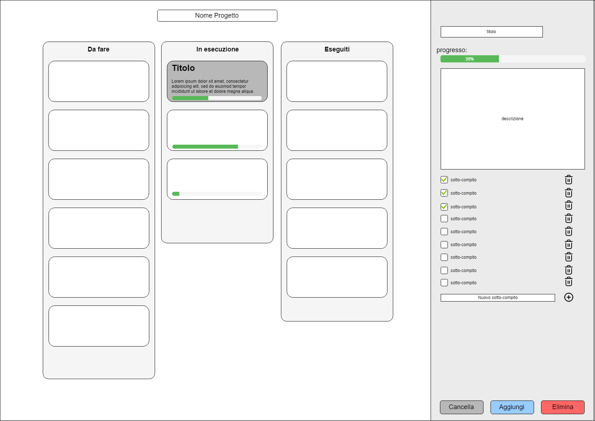

# Gestore di progetti

Guillaume Quint

---

## Documento di Analisi

### Vista statica dell'interfaccia (Mockup)

### Vista dinamica (scenario di utilizzo)

1. l'utente inserisce o modifica il nome del progetto
2. SE l'utente preme sul tasto `Aggiungi`
   1. SE almeno uno dei due campi `Titolo` o `Descrizione` è vuoto
      1. non succede niente
   2. ALTRIMENTI
      1. SE è stato raggiunto il numero massimo di compiti per la tabella `Da fare`
         1. non succede niente
      2. ALTRIMENTI
         1. viene aggiunto un nuovo compito nella tabella `Da fare`

[comment]: <> "3. l'utente può modificare il titolo o la descrizione di un compito in una della tre tabelle premendoci sopra e digitando il nuovo testo"

3. l'utente può selezionare un compito premendolo
   1. SE l'utente preme sul tasto `Elimina`
      1. il compito selezionato viene eliminato dalla tabella in cui si trova
   2. SE l'utente preme su uno dei tasti `>` o `<`
      1. SE è stato raggiunto il numero massimo di compiti per la tabella di destinazione
         1. non succede niente
      2. ALTRIMENTI
         1. il compito selezionato viene spostato nella tabella di destinazione adiacente come indicato dalla freccia
         2. viene aggiornato il grafico a torta 

### File di configurazione in XML

All'avvio il Sistema legge dal file di configurazione in XML i seguenti dati:

- indirizzo IP del client, indirizzo IP e porta del server di log
- username e password del DBMS
- IP e porta del DBMS
- nome dei tre stati disponibili (di default `Da fare`, `In esecuzione`, `Eseguiti`)
- id del progetto da caricare dal database
- se mostrare la legenda nel grafico a torta
- colore di sfondo
- massimo numero di compiti inseribili per ogni stato

### Cache locale degli input

Alla chiusura il Sistema salva in un file binario locale i campi `Titolo` e `Descrizione`, se questi non sono vuoti

All'avvio il Sistema carica da file binario, se sono presenti, il `Titolo` e la `Descrizione` negli appositi campi

### Archivio

Il Sistema archivia i seguenti dati:

- il nome del progetto
- tutti i compiti che appartengono al progetto. Di ciascuno viene salvato:
  - il titolo
  - la descrizione
  - lo stato a cui appartiene (se `Da fare`, `In esecuzione` o `Eseguito`)

### File di Log remoto in XML

Il sistema invia una riga di log ad ogni evento di seguito:

- avvio dell'applicazione ("AVVIO")
- pressione dei pulsanti `Aggiungi`, `Elimina`, `>`, `<`
- modifica del nome del Progetto ("CAMBIO NOME")
- termine dell'applicazione ("TERMINE")

La riga di log contiene: nome del progetto, indirizzo IP del client, data-ora corrente, etichetta dell'evento

## Documento di progetto

classi utilizzate:

## Documento di collaudo

E' qui riportata la schermata principale dell'applicazione. Sono presenti le tre tabelle che suddividono i compiti appartenenti al progetto a cui si  sta lavorando in tre fasi distinte (di default sono `Da fare`, `In esecuzione` e `Completati`)

Se la prima tabella non è piena, è possibile aggiungere un nuovo compito inserendone titolo e descrizione nei campi appositi e poi premere su `Aggiungi`

Per rimuovere un compito è invece sufficiente selezionarlo e premere sul pulsante `Elimina` che si sarà attivato

E' possibile modificare titolo e descrizione di un compito già presente, solo se appartiene alla prima tabella. E' sufficiente premere due volte su un compito e editare il campo della riga selezionata.

Per tenere traccia dell'andamento di un progetto, l'applicazione permette di spostare facilmente i compiti da una fase all'altra. E' sufficiente infatti selezionare un compito e usare i pulsanti a freccia per spostare il relativo record nella stato successivo (`>`) o quello precedente (`<`)

Ad ogni istante un grafico a torta riassume la distribuzione dei compiti tra le varie fasi

E' possibile configurare alcune parti dell'aspetto dell'interfaccia tramite il file xml, come il colore di sfondo, se mostrare o meno la legenda nel grafico e il nome dei tre stati per le tre tabelle. Per ricavare i compiti salvati nel database, è necessario impostare ip e porta del server db, oltre che l'id del progetto a cui si vuole accedere (che è sempre visibile nell'interfaccia)

Viene qui riportato il diagramma E-R utilizzato per rappresentare le informazione nel database, oltre che alcuni record di esempio

Ogni evento rilevante effettuato dall'utente, ossia accensione e spegnimento dell'applicazione, aggiunta, modifica e rimozione di compiti e modifica del nome del progetto viene inviato ad un logserver di cui è possibile specificare ip e porta nel file di config e che salverà in formato xml ogni messaggio ricevuto.

