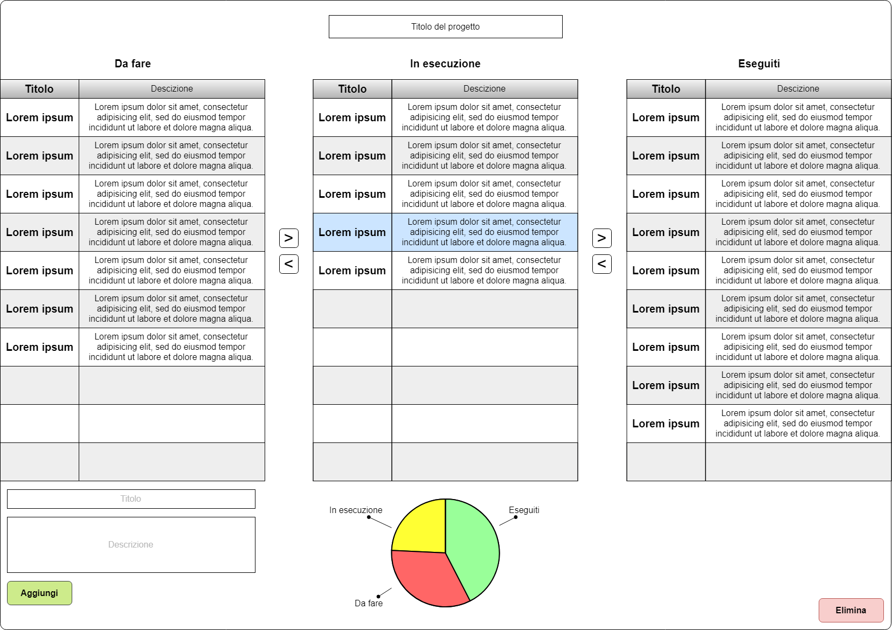
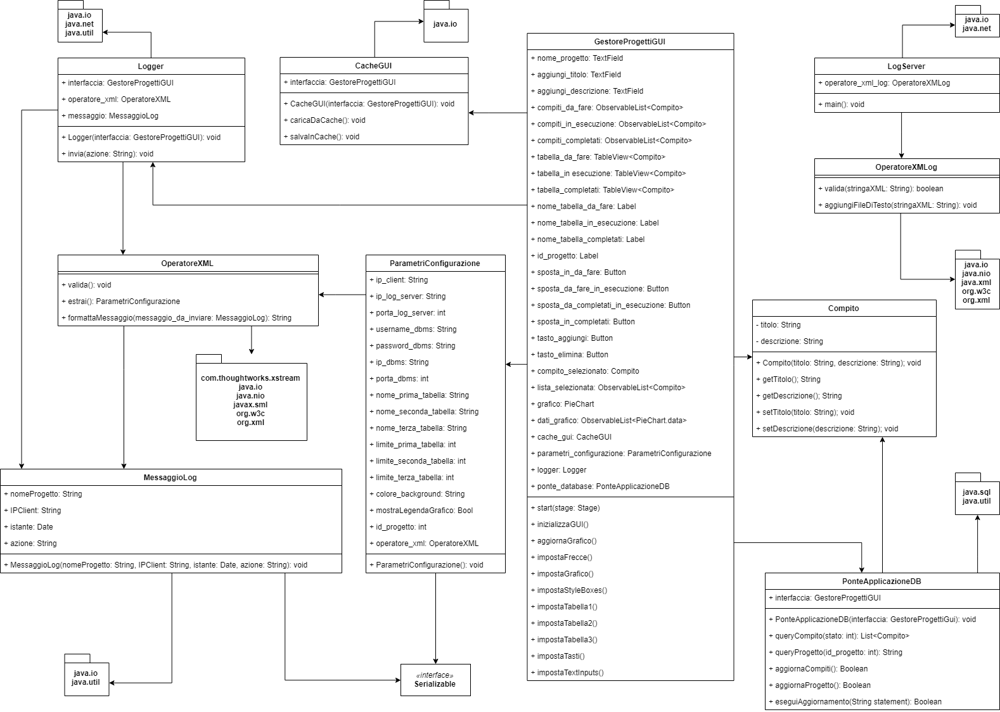
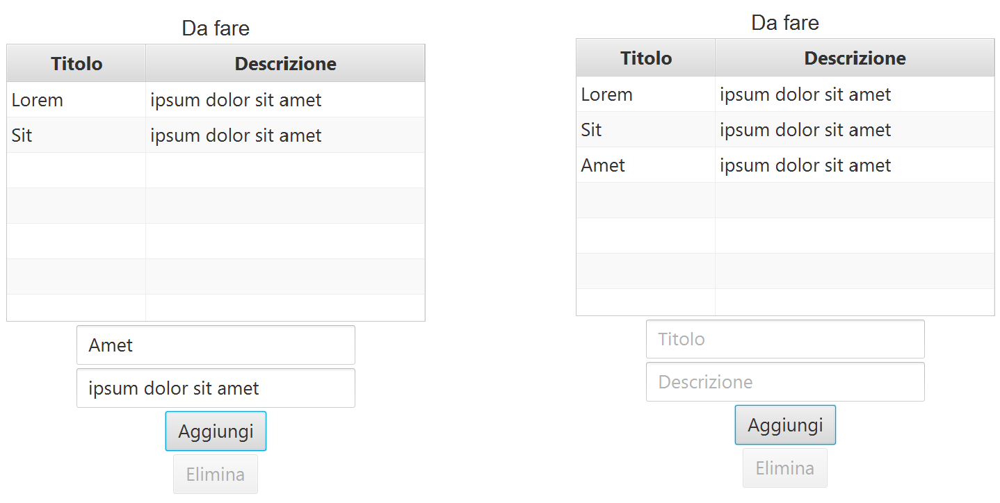

# Gestore di progetti

<p style="text-align: center;">Guillaume Quint</p>

---

## Documento di Analisi

### Vista statica dell'interfaccia (Mockup)



### Vista dinamica (scenario di utilizzo)

1. l'utente inserisce o modifica il nome del progetto
2. SE l'utente preme sul tasto `Aggiungi`
   1. SE almeno uno dei due campi `Titolo` o `Descrizione` è vuoto
      1. non succede niente
   2. ALTRIMENTI
      1. SE è stato raggiunto il numero massimo di compiti per la tabella `Da fare`
         1. non succede niente
      2. ALTRIMENTI
         1. viene aggiunto un nuovo compito nella tabella `Da fare`


[comment]: <> "3. l'utente può modificare il titolo o la descrizione di un compito in una della tre tabelle premendoci sopra e digitando il nuovo testo"

3. l'utente può selezionare un compito premendolo
   1. SE l'utente preme sul tasto `Elimina`
      1. il compito selezionato viene eliminato dalla tabella in cui si trova
   2. SE l'utente preme su uno dei tasti `>` o `<`
      1. SE è stato raggiunto il numero massimo di compiti per la tabella di destinazione
         1. non succede niente
      2. ALTRIMENTI
         1. il compito selezionato viene spostato nella tabella di destinazione adiacente come indicato dalla freccia
         2. viene aggiornato il grafico a torta 

### File di configurazione in XML

All'avvio il Sistema legge dal file di configurazione in XML i seguenti dati:

- indirizzo IP del client, indirizzo IP e porta del server di log
- username e password del DBMS
- IP e porta del DBMS
- nome dei tre stati disponibili (di default `Da fare`, `In esecuzione`, `Eseguiti`)
- id del progetto da caricare dal database
- se mostrare la legenda nel grafico a torta
- colore di sfondo
- massimo numero di compiti inseribili per ogni stato

### Cache locale degli input

Alla chiusura il Sistema salva in un file binario locale i campi `Titolo` e `Descrizione`, se questi non sono vuoti

All'avvio il Sistema carica da file binario, se sono presenti, il `Titolo` e la `Descrizione` negli appositi campi

### Archivio

Il Sistema archivia i seguenti dati:

- il nome del progetto
- tutti i compiti che appartengono al progetto. Di ciascuno viene salvato:
  - il titolo
  - la descrizione
  - lo stato a cui appartiene (se `Da fare`, `In esecuzione` o `Eseguito`)

### File di Log remoto in XML

Il sistema invia una riga di log ad ogni evento di seguito:

- avvio dell'applicazione ("AVVIO")
- pressione dei pulsanti `Aggiungi`, `Elimina`, `>`, `<`
- modifica del nome del Progetto ("CAMBIO NOME")
- termine dell'applicazione ("TERMINE")

La riga di log contiene: nome del progetto, indirizzo IP del client, data-ora corrente, etichetta dell'evento

## Documento di progetto

### Descrizione delle classi

- classe **GestoreProgettiGUI**: interfaccia principale dell'applicazione. Si occupa di mostrare lo stato attuale del progetto su cui si sta lavorando, compresi pulsanti e tabelle per l'interazione con i compiti. Si occupa anche di interagire con le altre parti dell'applicazione quando richiesto e mantiene aggiornato il grafico a torta riassuntivo
- classe **Compito**: definisce la struttura di un compito, così come viene rappresentato nel database, affinché possa essere aggiunto, modificato o eliminato tramite l'interfaccia
- classe **CacheGUI**: gestisce il salvataggio e il caricamento da file binario che serve da cache per alcuni elementi dell'interfaccia dell'applicazione. Viene automaticamente chiamato all'avvio e alla chiusura dell'applicazione.
- classe **OperatoreXML**: contiene le funzioni di estrazione di dati da file xml e validazione tramite il file xsd. Inoltre permette di formattare in xml un messaggio di Log, prima che questo venga inviato al log server.
- classe **Logger**: invia, sotto richiesta dell'interfaccia, un messaggio di log al log server. La componente caratteristica di un messaggio di log (ossia l'etichetta) viene aggiunta ad altre informazioni come l'istante temporale, l'ip del client, e il nome del progetto su cui si sta lavorando per essere formattata in xml dalla classe OperatoreXML e poi inviata al server di log
- classe **MessaggioLog** (serializzabile): definisce le caratteristiche che deve avere un messaggio di log per essere inviato al server di log. Queste comprendono l'etichetta distintiva dell'evento che deve essere registrato, l'istante temporale di registrazione, l'ip del clien e il nome del progetto su cui si sta lavorando. La classe, ovviamente serializzabile, viene trasmessa tramite socket in formato xml dalla classe Logger
- classe **ParametriConfigurazione** (serializzabile): definisce il contenuto del file di configurazione, rendendone accessibile alla classe interfaccia GestoreProgettiGUI i valori definiti dall'utente. 
- classe **PonteApplicazioneDB**: permette la connessione con il server DBMS. In particolare sono accessibili i metodi per accedere a tutti i compiti di un determinato stato, ed il nome del progetto su cui si sta lavorando. Alla chiusura dell'applicazione, e quindi alla sincronizzazione del database con il contenuto potenzialmente modificato dell'applicazione. Vengono svuotati tutti i compiti appartenenti al progetto su cui si sta lavorando e reinseriti in base a quelli attualmente presenti nell'applicazione
- classe **LogServer** (server): server di log in attesa infinita su un socket in ascolto di messaggi provenienti dall'applicazione. Registra i messaggi in arrivo in formato xml mostrandoli sulla console e concatenandoli a quelli già registrati in un file locate log.txt con il supporto della classe OperatoreXMLog
- classe **OperatoreXMLog**: classe di supporto al server di log per effettuare la validazione  tramite file xsd e per appendere effettivamente il contenuto ricevuto al file log.txt. Notare che questa classe non può essere accorpata alla classe OperatoreXML in quanto si trova a dover girare su una macchina differente del client e quindi, per non dover portar dietro tutto il resto dell'applicazione, si trova su un progetto differente.

### Diagramma UML di Classe



## Documento di collaudo

E' qui riportata la schermata principale dell'applicazione. Sono presenti le tre tabelle che suddividono i compiti appartenenti al progetto a cui si  sta lavorando in tre fasi distinte (di default sono `Da fare`, `In esecuzione` e `Completati`)


Se la prima tabella non è piena, è possibile aggiungere un nuovo compito inserendone titolo e descrizione nei campi appositi e poi premere su `Aggiungi`



Per rimuovere un compito è invece sufficiente selezionarlo e premere sul pulsante `Elimina` che si sarà attivato


E' possibile modificare titolo e descrizione di un compito già presente, solo se appartiene alla prima tabella. E' sufficiente premere due volte su un compito e editare il campo della riga selezionata.


Per tenere traccia dell'andamento di un progetto, l'applicazione permette di spostare facilmente i compiti da una fase all'altra. E' sufficiente infatti selezionare un compito e usare i pulsanti a freccia per spostare il relativo record nella stato successivo (`>`) o quello precedente (`<`)


Ad ogni istante un grafico a torta riassume la distribuzione dei compiti tra le varie fasi


E' possibile configurare alcune parti dell'aspetto dell'interfaccia tramite il file xml, come il colore di sfondo, se mostrare o meno la legenda nel grafico e il nome dei tre stati per le tre tabelle. Per ricavare i compiti salvati nel database, è necessario impostare ip e porta del server db, oltre che l'id del progetto a cui si vuole accedere (che è sempre visibile nell'interfaccia)

```xml
<?xml version="1.0" encoding="UTF-8"?>
<!-- skillshare_config.xml -->
<ParametriConfigurazione mostraLegendaGrafico="true">
	<limite_prima_tabella>3</limite_prima_tabella>
	<limite_seconda_tabella>3</limite_seconda_tabella>
	<limite_terza_tabella>4</limite_terza_tabella>
	<nome_prima_tabella>Da fare</nome_prima_tabella>
	<nome_seconda_tabella>In esecuzione</nome_seconda_tabella>
	<nome_terza_tabella>Completati</nome_terza_tabella>
	<colore_background>white</colore_background>
	<id_progetto>1</id_progetto>
	<ip_dbms>localhost</ip_dbms>
	<porta_dbms>3306</porta_dbms>
	<username_dbms>root</username_dbms>
	<password_dbms></password_dbms>
	<ip_client>localhost</ip_client>
	<ip_log_server>localhost</ip_log_server>
	<porta_log_server>4242</porta_log_server>
</ParametriConfigurazione>
```

Viene qui riportato il diagramma E-R utilizzato per rappresentare le informazione nel database, oltre che alcuni record di esempio


Ogni evento rilevante effettuato dall'utente, ossia accensione e spegnimento dell'applicazione, aggiunta, modifica e rimozione di compiti e modifica del nome del progetto viene inviato ad un logserver di cui è possibile specificare ip e porta nel file di config e che salverà in formato xml ogni messaggio ricevuto.

```xml
<MessaggioLog>
  <nomeProgetto>Titolo </nomeProgetto>
  <IPClient>localhost</IPClient>
  <istante>2021:06:08_18:18:32</istante>
  <azione>AVVIO</azione>
</MessaggioLog>

<MessaggioLog>
  <nomeProgetto>Titolo </nomeProgetto>
  <IPClient>localhost</IPClient>
  <istante>2021:06:08_18:18:47</istante>
  <azione>AGGIUNGI</azione>
</MessaggioLog>

<MessaggioLog>
  <nomeProgetto>Titolo </nomeProgetto>
  <IPClient>localhost</IPClient>
  <istante>2021:06:08_18:18:49</istante>
  <azione>sposta_da_fare_in_esecuzione</azione>
</MessaggioLog>

<MessaggioLog>
  <nomeProgetto>Titolo </nomeProgetto>
  <IPClient>localhost</IPClient>
  <istante>2021:06:08_18:18:51</istante>
  <azione>sposta_in_completati</azione>
</MessaggioLog>

<MessaggioLog>
  <nomeProgetto>Titolo </nomeProgetto>
  <IPClient>localhost</IPClient>
  <istante>2021:06:08_18:18:53</istante>
  <azione>sposta_da_completati_in_esecuzione</azione>
</MessaggioLog>

<MessaggioLog>
  <nomeProgetto>Titolo </nomeProgetto>
  <IPClient>localhost</IPClient>
  <istante>2021:06:08_18:18:55</istante>
  <azione>sposta_in_da_fare</azione>
</MessaggioLog>

<MessaggioLog>
  <nomeProgetto>Titolo 2</nomeProgetto>
  <IPClient>localhost</IPClient>
  <istante>2021:06:08_18:18:57</istante>
  <azione>CAMBIO NOME PROGETTO</azione>
</MessaggioLog>

<MessaggioLog>
  <nomeProgetto>Titolo 2</nomeProgetto>
  <IPClient>localhost</IPClient>
  <istante>2021:06:08_18:19:04</istante>
  <azione>MODIFICA DESCRIZIONE</azione>
</MessaggioLog>

<MessaggioLog>
  <nomeProgetto>Titolo 2</nomeProgetto>
  <IPClient>localhost</IPClient>
  <istante>2021:06:08_18:19:07</istante>
  <azione>MODIFICA TITOLO</azione>
</MessaggioLog>

<MessaggioLog>
  <nomeProgetto>Titolo 2</nomeProgetto>
  <IPClient>localhost</IPClient>
  <istante>2021:06:08_18:19:10</istante>
  <azione>RIMUOVI</azione>
</MessaggioLog>

<MessaggioLog>
  <nomeProgetto>Titolo 2</nomeProgetto>
  <IPClient>localhost</IPClient>
  <istante>2021:06:08_18:19:13</istante>
  <azione>STOP</azione>
</MessaggioLog>


```

